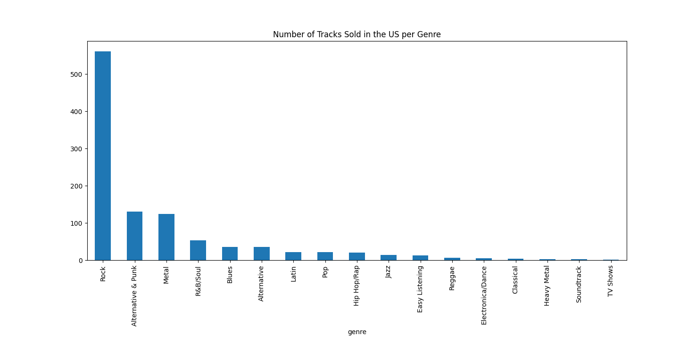
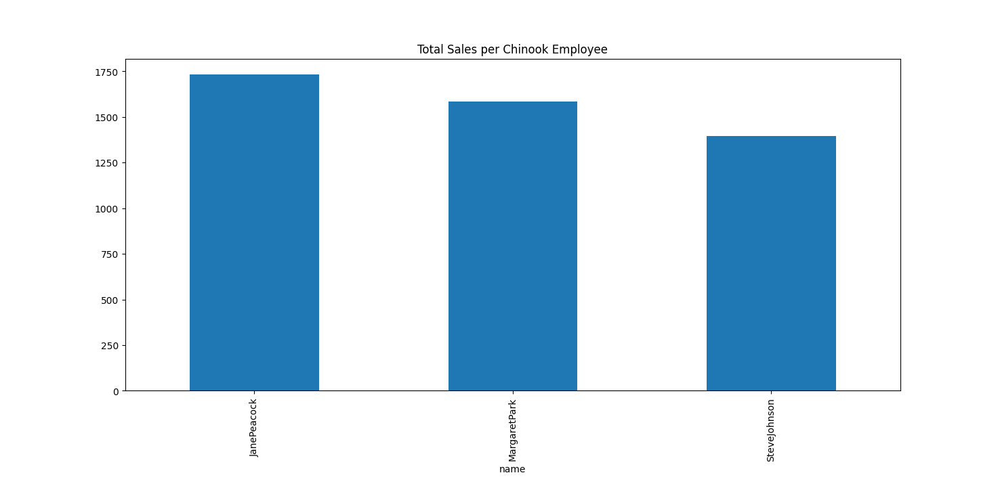
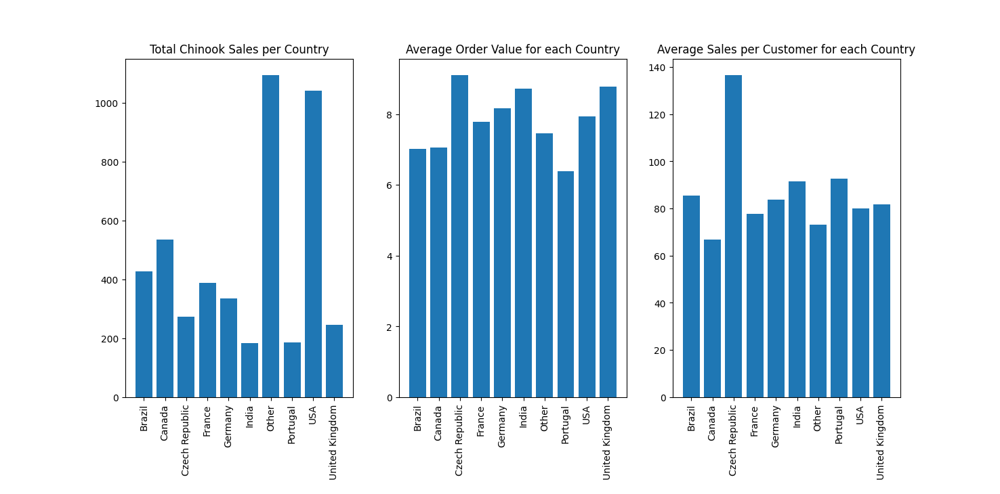

# Digital_Music_Store-Data_Analysis
#### Data Analysis And Visualizations on a fictional Music Store Data.

We will be working with a database called `Chinook` which contains information about a fictional music shop. 
The database includes several tables on invoice information, track, album, artist 
genre data, and employee and customer information related to the store's sales.

First SQL queries are done on `Chinook` Digital Music Store 
to help how they can optimize their business opportunities and 
to help answering business related questions code of which is :    
[_Code_](Chinook_Queries.py)

 
Now, we will use this database and the `sqlite3` module in order to explore and analyze four 
fictional business questions and propositions.
You can see full code of which [here](Chinook_Sales_Analysis.py)

Explanation :
### Set Up
We begin by importing the `sqlite3`, `pandas` and `matplotlib` Modules
and by taking a look at the database's schema in order to understand 
which tables it contains and how these are related.

```commandline
import sqlite3
import pandas as pd
import matplotlib.pyplot as plt
```

```commandline
db = "Statics/chinook.db"
```

```commandline
schema = 'Statics/ChinookSchema.png'
image = plt.imread(schema)
plt.figure()
plt.imshow(image)
plt.show()
```


We will now create some helper functions in order to run queries more efficiently in sqlite3.

- We create a `run_query()` function which takes as an argument a SQL query and returns the Pandas Dataframe corresponding to this query.
```commandline
def run_query(q):
    with sqlite3.connect('Statics/chinook.db') as conn:
        return pd.read_sql(q, conn)
```

- We now create a `show_tables()` function which uses our previous run_query() function to return a list of all the tables and views in our database.
```commandline
def show_tables():
    view_query = 'SELECT name, type FROM sqlite_master WHERE type IN ("table","view");'
    return run_query(view_query)
```
### Question 1: 
Suppose the Chinook record store signs a deal with a new record label and needs to select the first three albums it will add to the store from the following list. These albums are by artists that do not currently have tracks in the store. The new record label specializes in American artists, and have given Chinook funds to advertise the new albums in the United States. 
To address this business issue we will now analyze which genres are the most popular in the US. 

| Artist Name          | Genre     |
|----------------------|-----------|
| Regal                | 	Hip-Hop  |
| Red Tone             | 	Punk     |
| Meteor and the Girls | 	Pop      |
| Slim Jim Bites       | Blues     |


Solution:
```commandline
q1 = '''
WITH USA_sales AS (SELECT genre.name AS genre, COUNT(invoice_line.track_id) AS total_tracks
FROM invoice
JOIN track ON invoice_line.track_id = track.track_id
JOIN genre ON genre.genre_id = track.genre_id
JOIN invoice_line ON invoice.invoice_id = invoice_line.invoice_id
where billing_country like 'USA'
GROUP BY genre.name)
SELECT *, CAST((CAST(total_tracks as float) /(SELECT SUM(total_tracks) FROM USA_sales))*100 AS FLOAT) AS percentage
FROM USA_sales
ORDER BY 2 DESC
'''

USA_GENRE_SALES = run_query(q1)
print(USA_GENRE_SALES)

USA_GENRE_SALES = USA_GENRE_SALES.set_index('genre')
USA_GENRE_SALES['total_tracks'].plot.bar()
plt.title('Number of Tracks Sold in the US per Genre')
plt.show()
```

Output :

|     |               genre |  total_tracks |  percentage |
|:----|--------------------:|--------------:|------------:|
| 0   |                Rock |           561 |   53.377735 |
| 1   |  Alternative & Punk |           130 |   12.369172 |
| 2   |               Metal |           124 |   11.798287 |
| 3   |            R&B/Soul |            53 |    5.042816 |
| 4   |               Blues |            36 |    3.425309 |
| 5   |         Alternative |            35 |    3.330162 |
| 6   |               Latin |            22 |    2.093245 |
| 7   |                 Pop |            22 |    2.093245 |
| 8   |         Hip Hop/Rap |            20 |    1.902950 |
| 9   |                Jazz |            14 |    1.332065 |
| 10  |      Easy Listening |            13 |    1.236917 |
| 11  |              Reggae |             6 |    0.570885 |
| 12  |   Electronica/Dance |             5 |    0.475737 |
| 13  |           Classical |             4 |    0.380590 |
| 14  |         Heavy Metal |             3 |    0.285442 | 
| 15  |          Soundtrack |             2 |    0.190295 |
| 16  |            TV Shows |             1 |    0.095147 |



From the above graph, we observe that the most popular genre sold by Chinook in the US is by 
the Rock genre (53.38%). From the list of artists, 
we note that the most popular genres in order of popularity are Alternative & Punk (12.37%), Blues (3.43%) and Pop (2.09%). 
We therefore recommend to add the albums by Red Tone, 
Meteor and the Girls, and Slim Jim Bites.


### Question 2:
Each Chinook customer gets assigned to a sales support agent after completing their first purchase. We will now analyze customer purchases belonging to each employee to identify and compare the performance of sales support agents.

Solution:
```commandline
q2 = '''
SELECT employee_id, e.first_name || e.last_name as name,birthdate, reports_to, hire_date, e.country, SUM(total) AS employee_sales
FROM invoice i 
JOIN customer c ON c.customer_id = i.customer_id
JOIN employee e on e.employee_id = c.support_rep_id
GROUP BY 1,2
ORDER BY 6 DESC
'''

employee_sales = run_query(q2)
print(employee_sales)

employee_sales = employee_sales.set_index('name')
employee_sales['employee_sales'].plot.bar()
plt.title('Total Sales per Chinook Employee')
plt.show()
``` 




We note that there are three sales support agents covering Chinook's customers. 
Sales are distributed relatively evenly between the agents. 
We make the following observations: 
- First, all the agents are from Canada. 
- Secondly, the agents have approximately the same level of experience in the store as they were hired within a few months from each other. 
- Third, the agent with the highest amount of sales is the youngest, which could potentially reflect an ability to connect to a younger customer market.

### Question 3:
We will now analyze the sales data for customers from each country. Guidance has been provided on using the country value from the customer table as opposed to the billing_country from the invoice table. This could be due to the customer's billing address differing from the actual location where the customer completed their purchase.

Solution:
```commandline
q3 = '''    
WITH country_sales AS(
    SELECT 
        c.country AS Country,
        SUM(i.total) AS Total_Purchases,
        COUNT(DISTINCT(c.customer_id)) AS Total_Customers,
        COUNT(i.invoice_id) AS Total_Orders
    FROM invoice i
    JOIN customer c ON c.customer_id = i.customer_id
    GROUP BY 1),
    country_sales_agg AS (
        SELECT
            CASE
                WHEN total_Customers = 1 THEN 'Other'
                ELSE country
            END AS country_identification,
            SUM(Total_purchases) AS Total_Sales,
            SUM(Total_customers) AS Total_Customers,
            SUM(Total_Orders) AS Total_Orders
        FROM country_sales
        GROUP BY 1)
    
SELECT
    country_identification as Country,
    Total_Customers,
    Total_Sales, 
    CAST(Total_Sales / Total_Customers as float) AS Average_sales_per_customer, 
    CAST(Total_Sales / Total_Orders as float) AS Average_order_value
    FROM country_sales_agg
    ORDER BY 1
'''

country_sales_data = run_query(q3)
print(country_sales_data)

fig,ax = plt.subplots(1,3)
ax[0].bar(country_sales_data['Country'],country_sales_data['Total_Sales'])
ax[1].bar(country_sales_data['Country'],country_sales_data['Average_order_value'])
ax[2].bar(country_sales_data['Country'],country_sales_data['Average_sales_per_customer'])
ax[0].set_title('Total Chinook Sales per Country')
ax[1].set_title('Average Order Value for each Country')
ax[2].set_title('Average Sales per Customer for each Country')
ax[0].set_xticklabels(country_sales_data['Country'],rotation=90)
ax[1].set_xticklabels(country_sales_data['Country'],rotation=90)
ax[2].set_xticklabels(country_sales_data['Country'],rotation=90)
plt.show()
```


From the above table and visualizations, 
We can observe that, on its own, the US is Chinook's largest market, followed by Canada and Brazil. 
The `'Other'` row includes sales from countries with a single customer. 

- However, we see a clear difference between average sales in all of its countries (around 80 - 90 USD per customer on average) and average sales in Czech Republic of 136 USD per customer. 
- This indicates that in this country average revenue per customer is significantly higher and targeted marketing could potentially be more profitable per customer compared to its other markets. 
- Average order value tends to be approximately 8 USD per order; again, we notice that in the Czech Republic this value is slightly higher than in other countries at 9 USD per order.

### Question 4 :
Chinook's current sales strategy allows customers to make purchases in the following ways:

- purchase a whole album
- purchase a collection of one or more individual tracks

Customers are not allowed to purchase a whole album and then add individual tracks to that same purchase, unless they do so by manually choosing each track. Customers who purchase an album are charged the equivalent of the sum of the price of each of the tracks purchased.

Chinook's management is considering a change in their purchasing strategy by which they only purchase the most popular tracks from each album, instead of purchasing all of the tracks. To evaluate this proposal, we will analyze the percentage of purchases that are individual tracks compared to purchases of entire albums in order to understand the impact on revenue should management pursue this change of strategy.

Solution:
```commandline
WITH album_tracks_dictionary AS
    (SELECT 
        a.album_id AS album_id,
        t.track_id AS track_id
    FROM album a
    JOIN track t ON a.album_id = t.album_id),
invoice_tracks_album AS
    (SELECT 
        il.invoice_id as invoice_id,
        atd.album_id AS album_id,
        atd.track_id AS track_id
    FROM invoice_line il
    JOIN album_tracks_dictionary atd ON atd.track_id = il.track_id),
invoice_full_dictionary AS
(
SELECT 
    ita.invoice_id AS invoice_id,
    CASE 
        WHEN
            (
            SELECT track_id FROM (SELECT itainv.track_id AS track_id
                                  FROM invoice_tracks_album itainv
                                  WHERE itainv.invoice_id = ita.invoice_id)
            EXCEPT 
            SELECT track_id FROM (SELECT ald.track_id AS track_id
                                  FROM album_tracks_dictionary ald
                                  WHERE ald.album_id = ita.album_id)
            ) IS NULL
            AND
            (
            SELECT track_id FROM (SELECT ald.track_id AS track_id
                                  FROM album_tracks_dictionary ald
                                  WHERE ald.album_id = ita.album_id)
            EXCEPT 
            SELECT track_id FROM (SELECT itainv.track_id AS track_id
                                  FROM invoice_tracks_album itainv
                                  WHERE itainv.invoice_id = ita.invoice_id)
            ) IS NULL
            THEN 1
        ELSE 0
    END AS Full_Album
FROM invoice_tracks_album ita
),
invoice_dictionary AS
(
SELECT 
    invoice_id,
    MAX(Full_Album) as Full_Album
FROM invoice_full_dictionary 
GROUP BY 1
)

SELECT
    COUNT(id.invoice_id) AS Total_invoices,
    SUM(id.Full_Album) AS Total_Full_Album,
    (CAST(SUM(id.Full_Album) / CAST(COUNT(id.invoice_id) as float) * 100 as float)) AS Percentage_Full_Album
FROM invoice_dictionary id 
'''
q4 = run_query(q4)
print(q4)
```
Output:

|      |  Total_invoices |  Total_Full_Album |  Percentage_Full_Album |
|:-----|----------------:|------------------:|-----------------------:|
| 0    |             614 |               114 |              18.566775 |

From the above, we note that only 19% of invoices are related to the purchase of whole albums. 
From this, we can infer that approximately 80% of purchases are made by customers seeking specific tracks, instead of purchasing whole albums. 
- This seems to indicate that Chinook's strategy of only purchasing popular tracks could be a profitable one as purchases do not appear to be driven by less popular songs that are part of albums.

